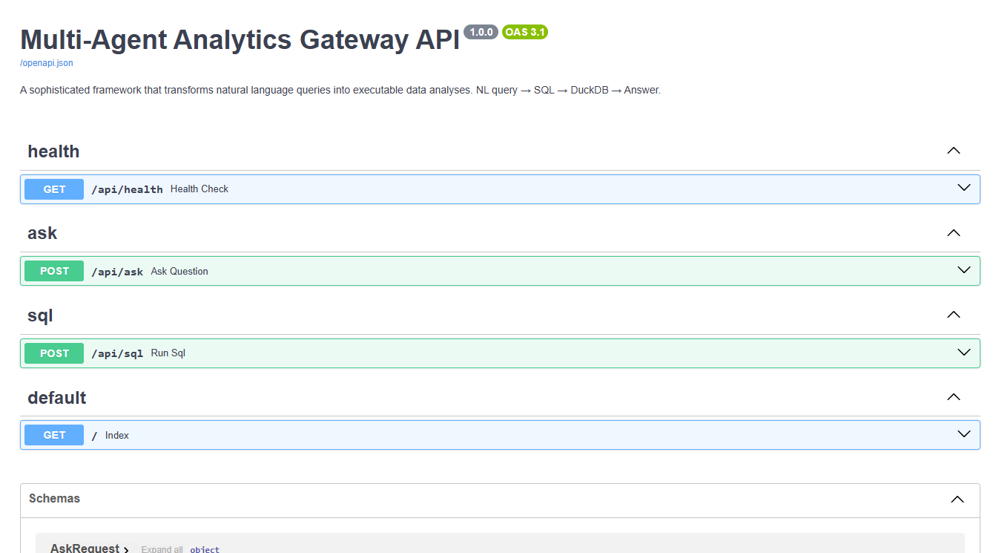
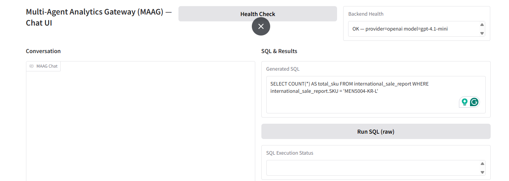
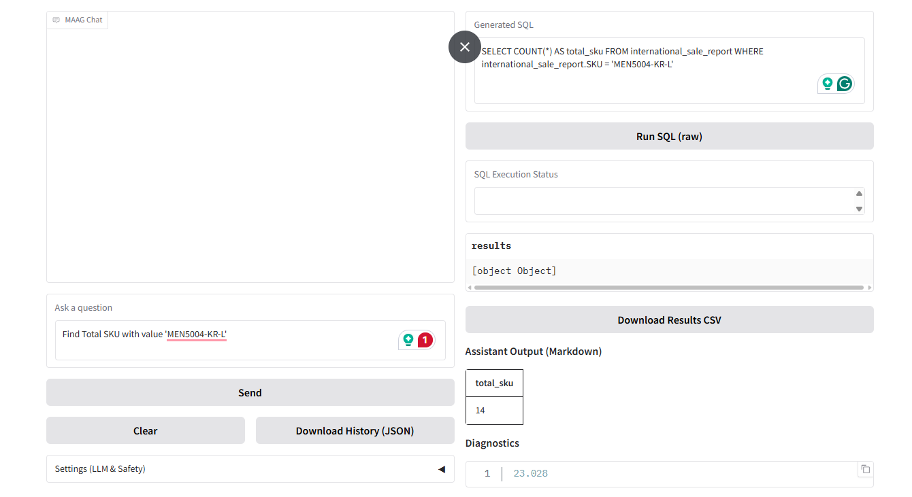

# Multi-Agent Analytics Gateway (MAAG)
A Production-Ready Agentic Analytics Engine  
Transforming **Natural Language → SQL → Executable Insights** using  
**RAG, Multi-Agent Workflow, DuckDB, FAISS, and LLM Orchestration**

---

## 🧠 1. Overview

The **Multi-Agent Analytics Gateway (MAAG)** is a modular, scalable, agent-driven analytics framework designed to convert **natural language questions into validated SQL queries**, execute them against a **DuckDB data lake**, and return **concise, accurate insights**.

MAAG combines:

- **Multi-Agent System (MAS)**
- **Retrieval-Augmented Generation (RAG)**
- **Metadata Vector Indexing (FAISS)**
- **DuckDB Query Engine**
- **LLM Prompt Orchestration**
- **Token Safety Layer**
- **FastAPI Backend**
- **Gradio UI**

MAAG is engineered to be:

- 💡 **Explainable** (SQL shown to user)  
- 🧱 **Modular** (each agent is replaceable)  
- 🚀 **Scalable** (works on 1MB → 100GB parquet datasets)  
- 🔐 **Safe** (token guards + row limits)  
- 🛠 **Deployable** (Docker, EC2-ready)

---

## 📦 2. Key Features

### ✔️ Multi-Agent Pipeline
- **Retrieval Agent** → build contextual understanding using FAISS metadata  
- **NL→SQL Agent** → translate natural language into SQL  
- **SQL Validator Agent** → correct structure, fix missing table/columns  
- **SQL Executor** → safe execution with row limits  
- **Response/Summarization Agent** → final human-readable insight

---

### ✔️ Metadata-Based RAG
Instead of embedding full dataset (too large), we embed **table schemas, column names, and column descriptions** — lightweight and scalable.

---

### ✔️ LLM Provider Switching
Swap between:
- **OpenAI**
- **Gemini**
- **Ollama (local models)**  
via `.env` or config settings.

---

### ✔️ DuckDB Execution Layer
Reads **Parquet** directly without loading entire dataset into memory.

Perfect for:
- 10MB CSV  
- 50GB Parquet  
- 100GB+ partitioned data lakes  

---

### ✔️ Token Safety Guard
Prevents runaway token usage:
- Blocks prompts that exceed estimated token cost  
- Stops queries returning huge row sets  
- Toggleable from config

---

### ✔️ FastAPI Backend (Production Ready)
Provides:
- `/api/ask` → NL query endpoint  
- `/api/sql` → raw SQL endpoint  
- `/api/health` → system diagnostics  

---

### ✔️ Gradio UI (Simple + Minimal)
Frontend for interactive querying.

---

### ✔️ CLI Ingestion & Pipeline Runner
`main.py` serves as ingestion and FAISS index builder.

---

## 📁 3. Project Structure

```
.
├── api/
│   ├── models/
│   │   ├── ask.py
│   │   ├── sql.py
│   ├── routes/
│   │   ├── ask_routes.py
│   │   ├── sql_routes.py
│   │   ├── health_routes.py
│   ├── server.py
│
├── agents/
│   ├── controller.py
│   ├── nl_to_sql_agent.py
│   ├── retrieval_agent.py
│   ├── validation_agent.py
│   ├── summarization_agent.py
│   ├── response_agent.py
│
├── core/
│   ├── config.py
│   ├── llm.py
│   ├── rag.py
│   ├── sql_executor.py
│   ├── utils.py
│
├── ingestion/
│   ├── loader.py
│   ├── converter.py
│   ├── cleaner.py
│
├── db/
│   ├── duckdb_client.py
│   ├── index_builder.py
│   ├── metadata_store.py
│
├── ui/
│   ├── app.py (Gradio UI)
│
├── data/
│   ├── raw/
│   ├── processed/
│   ├── metadata/
│   ├── retail.duckdb
│
├── scripts/
│   ├── test_rag.py
│   ├── test_agents.py
│   ├── ingest_all.py
│
├── main.py
├── README.md
├── architecture.md
```

---

## ⚙️ 4. Installation & Setup

### **1. Clone Repo**
```
mkdir MAAG
cd MAAG
git clone https://github.com/SourabhGuptaGit/Multi-Agent-Analytics-Gateway.git .
```

### **2. Create environment**
```
uv venv
.\.venv\Scripts\activate  # Windows
source ./.venv/bin/activate  # Linux/Mac
```

### **3. Install dependencies**
```
uv pip install -r requirements.txt
```

### **4. Create `.env`**
```
OPENAI_API_KEY=sk-xxxx
GEMINI_API_KEY=xxxxx
LLM_PROVIDER=openai
LOG_LEVEL=INFO
```

---

## 📥 5. Ingestion Pipeline (CSV → Parquet → DuckDB → FAISS Metadata)

### **Add CSV files to:**
```
data/raw/
```

### **Run ingestion**
```
python main.py ingest
```

### **Rebuild FAISS index**
```
python main.py rebuild
```

This will:
- Convert CSV → Parquet  
- Register tables in DuckDB  
- Extract metadata JSON  
- Build FAISS index for metadata search  

---

## 🚀 6. Running the Backend API

```
uvicorn api.server:app --reload --port 8000
```

Open:
```
http://localhost:8000/docs
```

---

## 💬 7. Running the UI

```
python ui/app.py
```

Gradio will launch at:
```
http://localhost:7860
```

---

## 🔄 8. Complete End-to-End Flow

### Step-by-step:
1. User enters a natural language question  
2. Retrieval agent pulls metadata using FAISS  
3. NL→SQL agent generates SQL  
4. SQL Validator agent validates / auto-fixes  
5. SQL Executor runs on DuckDB  
6. Response Agent summarizes result in human language  
7. UI/API returns SQL + answer + table  

---

## 📈 9. Scaling Beyond 100GB (Design Notes)

This system is scalable because:

### ✔️ DuckDB reads Parquet **lazily**
- No need to load entire dataset  
- Operates on compressed columnar chunks  

### ✔️ Metadata RAG is kept small  
You embed only:
- Table names  
- Column names  
- Column sample stats  

Even 5000 tables will produce tiny metadata.

### ✔️ FAISS Index handles millions of embeddings  
With:
- IVF  
- HNSW  
- PQ compression  

### ✔️ SQL Executor performs vectorized operations

### ✔️ LLM Agents do NOT see raw data  
Only:
- Schemas  
- Query context  
- Summaries  

### ✔️ Horizontal scaling with:
- Distributed FAISS (e.g., Milvus or Pinecone)  
- Partitioned Parquet  
- Multiple orchestrator workers  

---

## 🔐 10. Safety Layers

### Token Safety Guard  
- Reject large prompts  
- Reject queries returning too many rows  
- Toggle safety from config  

### SQL Safety  
- Prevents DDL/DML  
- Allows only SELECT  

### Flow Safety  
- Early rejection for out-of-domain queries  
- Controlled LLM usage  

---

## 📚 11. API Reference

### `POST /api/ask`
Natural language → structured insight.

### `POST /api/sql`
Run raw SQL.

### `GET /api/health`
Version, provider, model.

---

## 🚢 12. Deployment (Docker + EC2 Ready)

### Build:
```
docker build -t maag .
```

### Run:
```
docker-compose up
```

Supports:
- FastAPI backend
- Gradio UI
- DuckDB in persistent volume
- Optional reverse proxy

---

## 🧩 13. Future Enhancements

- Semantic SQL join graph  
- Multi-table join planner  
- Interactive dashboards  
- Streaming query results  
- User-level auth + sessions  
- LangGraph workflow UI  

---

## 🤝 14. Credits

Designed & implemented as part of an advanced agentic analytics assignment using:
- Python  
- DuckDB  
- FAISS  
- LangChain components  
- OpenAI + Gemini  
- FastAPI  
- Gradio  

---

## 🖥️ 15. Technical Documentation & Presentation

[View Full MAAG Technical Architecture Presentation (PPT)](./MAAG_Docs/MAAG.pptx)


---

## 📹 16. FastAPI and Gradio UI ⚙️

The system flows from the Gradio UI/FastAPI layer down through the agent pipeline and DuckDB executor.

<p align="center">
  
  <br>
  <i>FastAPI API's to access MAAG.</i>
</p>

<p align="center">
  
  <br>
  <i>Gradio UI to access MAAG.</i>
</p>

<p align="center">
  
  <br>
  <i>Gradio UI to access MAAG.</i>
</p>


---

# 🚀 MAAG is now ready for production-grade evaluation!

